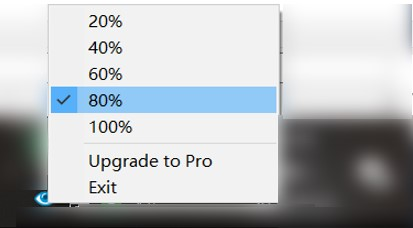
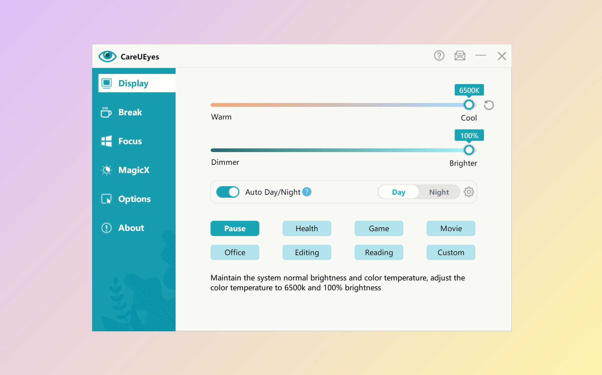

# CareUEyes Lite

[简体中文](README.zh-CN.md)

CareUEyes Lite is an open-source Windows screen dimmer from CareUEyes. It is designed for people who spend long hours in front of screens and want a lightweight way to make their displays more comfortable.

CareUEyes Lite is intentionally minimal. It focuses on gamma-based screen brightness control and does not include the additional eye-care modules available in CareUEyes Pro.

CareUEyes Lite uses software gamma adjustment. It does not change the physical brightness level or OSD brightness value of your monitor.

## Download

You can download the latest version from the GitHub Releases page, or visit the official CareUEyes website:

https://care-eyes.com/?lite

## Screenshot



## Features

- Adjust screen brightness from the system tray
- Apply brightness presets: 20%, 40%, 60%, 80%, and 100%
- Support multi-monitor gamma-based dimming
- Restore brightness after display, power, or session changes
- Keep the experience focused on core brightness control, without extra bundled features

## Lite and Pro

CareUEyes Lite provides the open-source core screen dimming experience for Windows.

For a complete eye-care experience, CareUEyes Pro is available for both Windows and macOS. It includes blue light filtering, color temperature adjustment, custom brightness control, break reminders, focus tools, and advanced automation.

https://care-eyes.com/?lite




## Build

CareUEyes Lite is a Win32 project built with Visual Studio 2005.

Open:

```text
careueyes-lite.sln
```

Or build from the command line:

```text
"C:\Program Files (x86)\Microsoft Visual Studio 8\Common7\IDE\devenv.exe" careueyes-lite.sln /Build Release
```

The output executable is:

```text
Release/CareUEyes.exe
```

The output executable is currently named `CareUEyes.exe` for compatibility with the original project structure.

## Project Scope

This repository is for CareUEyes Lite. Contributions should stay focused on the lightweight screen dimming experience, compatibility, build reliability, and documentation.

Features such as blue light filtering, break reminders, focus tools, advanced scheduling, and richer multi-monitor workflows belong to CareUEyes Pro.

## License

The source code is released under the MIT License.

The CareUEyes name, logo, website, product screenshots, and other brand assets are not licensed under MIT unless explicitly stated.
